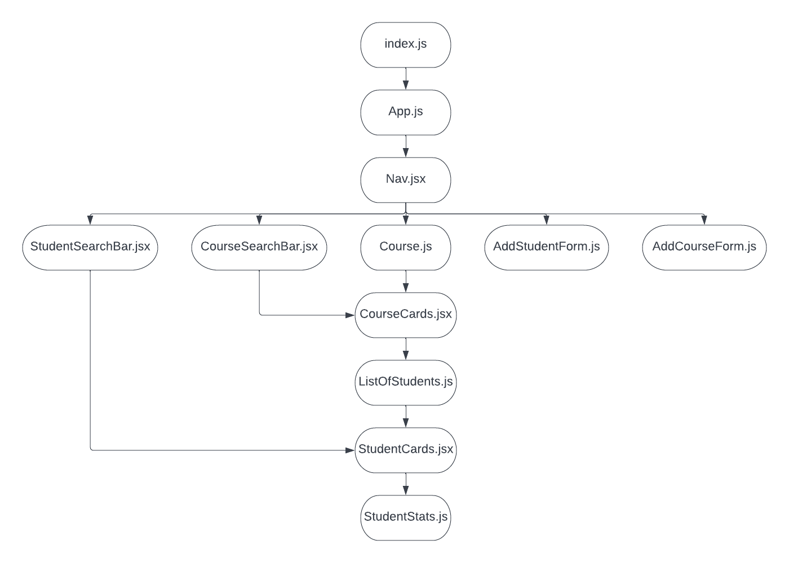
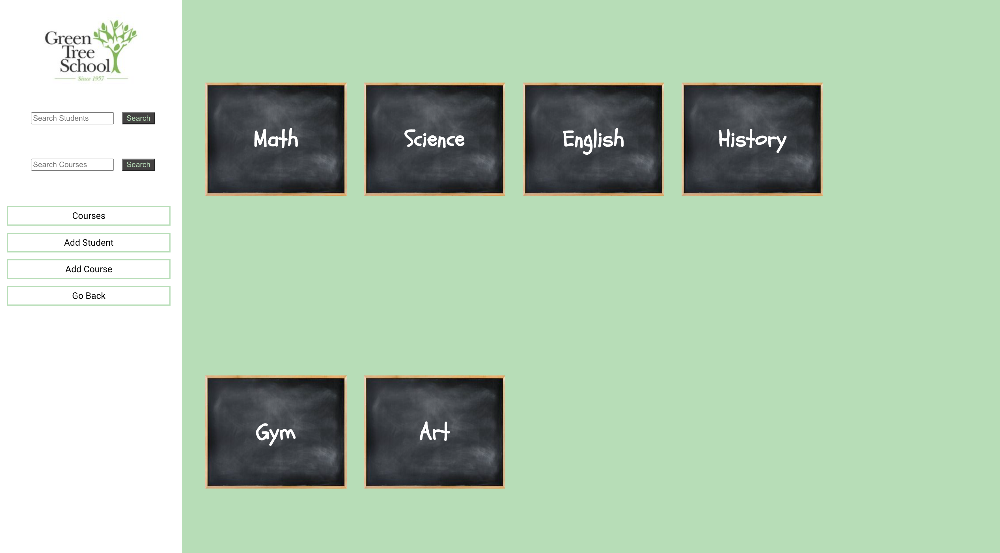

# Student Course Hackathon Frontend

## Date: 11/18/2022

### Kalen Luciano: [GitHub](https://github.com/kalenluciano) | [Linkedin](https://www.linkedin.com/in/kalenluciano/)

### Maciej Parol: [GitHub](https://github.com/Codetitude) | [Linkedin](https://www.linkedin.com/in/maciej-parol-/)

### James Fleming: [GitHub](https://github.com/James-fleming394) | [LinkedIn](https://www.linkedin.com/in/james--fleming/)

### David Caldwell: [GitHub](https://github.com/LeaderOfTheLost) | [Linkedin](https://www.linkedin.com/in/david-caldwell92/)

### [Deployed Site](https://green-tree-school.herokuapp.com/)

---

### **_Description_**

This app allows a user to view a list of students and courses they're enrolled in.

---

### **_Technologies_**

-   React.js
-   JavaScript
-   CSS
-   HTML

**_Component Hierarchy Diagram_**

---

### **_Getting Started_**

1. `Fork` and `clone`
2. Run `npm install`
3. Run `npm start`

A trello board used to keep track of development progress can be [viewed here](https://trello.com/b/1qiVnuLP/student-course-hackaton).

The project itself was deployed and can be [viewed here](https://green-tree-school.herokuapp.com/).

---

### **_Screenshots_**

#### Home Page

#### Course Page

#### Student Page

---

### **_Future Updates_**

-   [ ] Make it mobile friendly
-   [ ] Add full CRUD for students
-   [ ] Redesign front page
